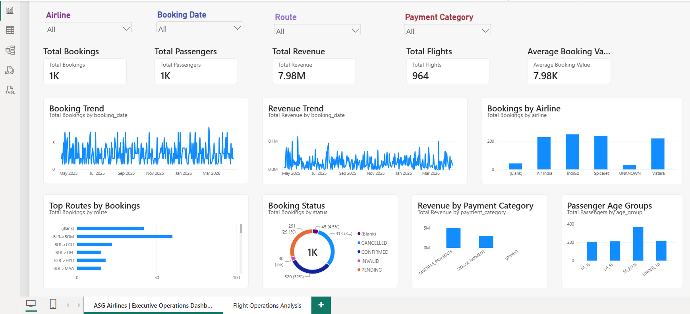
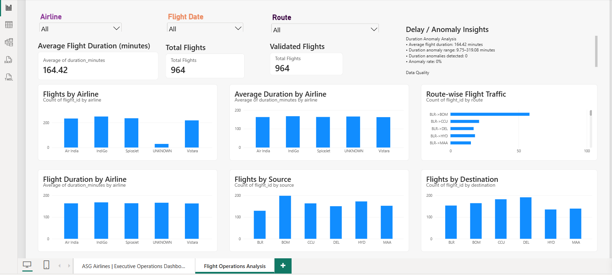
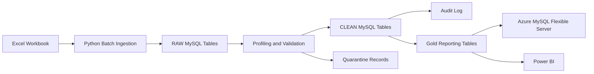
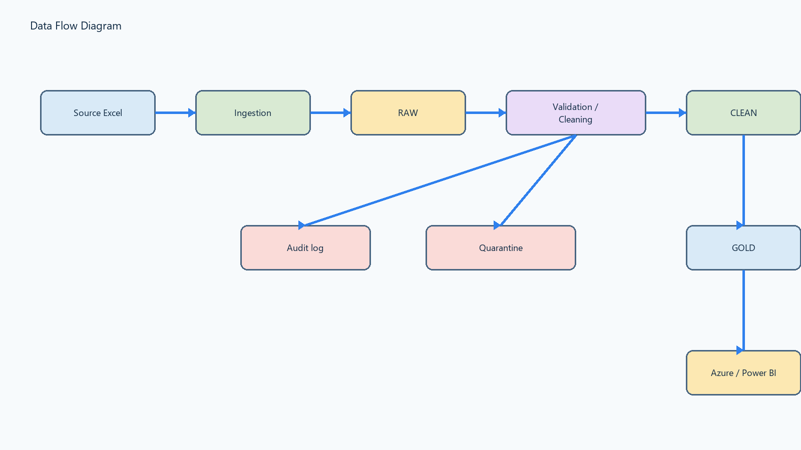
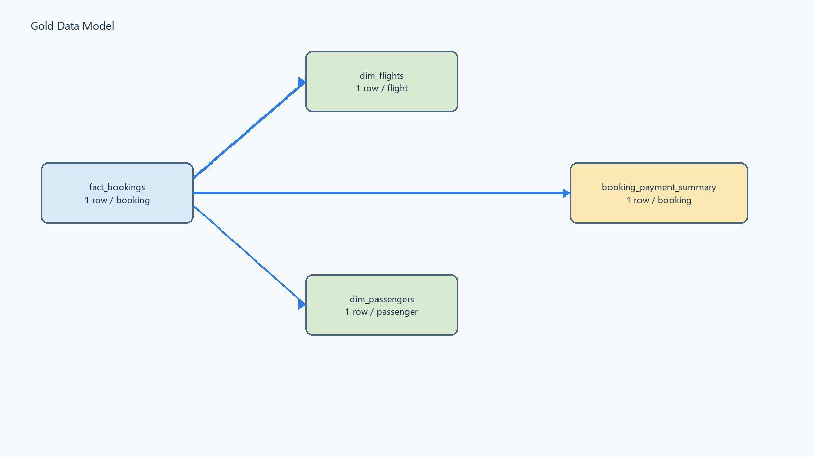

# ASG Airlines Data Engineering

## NeoStats Data Engineering Assessment

This project is an end-to-end data engineering pipeline created for the NeoStats ASG Airlines assessment. It takes airline data from an Excel workbook, cleans and validates it, stores the processed data in MySQL, creates reporting-ready Gold tables, synchronizes the validated data to Azure Database for MySQL Flexible Server, and uses Power BI for business reporting.

**Python | MySQL | Azure MySQL | Power BI | Pytest**

---

## Power BI Dashboard

### Executive Operations Dashboard



### Flight Operations Analysis



The Power BI report contains two pages:

- **Executive Operations Dashboard**: bookings, passengers, revenue, flights, airlines, routes, booking status, payment categories and interactive filters.
- **Flight Operations Analysis**: flight duration, airline and route analysis, source/destination analysis and duration anomaly insights.

Power BI reads only the Gold reporting tables and does not directly use the RAW/CLEAN operational tables.

---

## Azure Deployment

A key part of this project is the deployment of the validated reporting data to Azure Database for MySQL Flexible Server.

| Setting | Value |
|---|---|
| Resource Group | `rg-neostats-airlines` |
| MySQL Server | `asg-airlines-mysql-2026` |
| Database | `asg_airlines` |
| Region | South India |
| MySQL Version | 8.4 |

The cloud flow is:

```text
Excel Workbook
      |
      v
Python Data Pipeline
      |
      v
Local MySQL
RAW -> CLEAN -> GOLD
      |
      v
Incremental / Idempotent Azure Synchronization
      |
      v
Azure Database for MySQL
      |
      v
Power BI
```

### Azure Synchronization

Validated data is synchronized from the local MySQL environment to Azure using bounded, key-based and idempotent synchronization.

The synchronization process includes:

- Azure identity checks
- Schema checks
- Bounded batches
- Key-based upserts
- Transactions
- Deterministic governance keys
- Local/Azure reconciliation
- Duplicate protection

The regular synchronization script is:

```text
scripts/sync_local_to_azure.py
```

The initial migration scripts are kept separately for initial provisioning or recovery and are not used as the normal scheduled ETL process.

Azure credentials are supplied through runtime configuration and are not stored in GitHub.

---

## Business Problem

ASG Airlines receives flight, booking, passenger and payment data from operational systems. The source workbook contains different data-quality issues such as missing values, malformed identifiers, duplicate/conflicting records, invalid timestamps and payment issues.

The objective of the pipeline is to preserve the original data, apply clear cleaning rules, isolate unsafe records, create reliable reporting data and make the final information available in Azure and Power BI.

---

## Project Objectives

- Ingest the source Excel workbook without changing the original RAW values.
- Profile and validate the incoming data.
- Clean records using a fixed data-cleaning rulebook.
- Record automatic corrections in an audit table.
- Quarantine records that cannot be safely resolved.
- Handle flight duration and overnight flights correctly.
- Preserve valid multiple-payment records.
- Build reporting-ready Gold tables.
- Protect direct passenger identifiers from reporting.
- Synchronize validated data to Azure MySQL.
- Support repeatable and idempotent processing.
- Provide a Power BI dashboard for business analysis.

---

## Architecture



The pipeline is divided into logical layers:

| Layer | Purpose | Main Tables |
|---|---|---|
| Control | Run and batch tracking | `etl_runs`, `etl_batches` |
| RAW | Source-preserving records | `raw_flights`, `raw_bookings`, `raw_passengers`, `raw_payments` |
| CLEAN | Typed and rule-processed records | `clean_flights`, `clean_bookings`, `clean_passengers`, `clean_payments` |
| Audit/Quarantine | Corrections and unsafe records | `audit_log`, `quarantine_records` |
| GOLD | Reporting-ready data | `dim_flights`, `dim_passengers`, `booking_payment_summary`, `fact_bookings` |
| Azure | Cloud database target | Azure MySQL Flexible Server |
| Reporting | Business analytics | Power BI |

---

## Data Flow



The complete flow is:

```text
UseCase - Airlines.xlsx
        |
        v
Python Ingestion
        |
        v
RAW
        |
        v
Profiling
        |
        v
Cleaning and Validation
       / \
      /   \
     v     v
  CLEAN  Quarantine
     |
     v
Audit / Governance
     |
     v
Gold Reporting Layer
     |
     +------> Azure MySQL
     |
     +------> Power BI
```

The main steps are:

1. Read the Excel workbook.
2. Load the source records into RAW MySQL tables.
3. Profile the incoming data.
4. Apply the cleaning rules.
5. Validate keys, relationships, timestamps and payments.
6. Record corrections in `audit_log`.
7. Move unsafe records to `quarantine_records`.
8. Create the Gold reporting layer.
9. Synchronize validated data to Azure.
10. Use Gold data in Power BI.

---

## Source Dataset

The source workbook is:

```text
data/raw/UseCase - Airlines.xlsx
```

It contains four sheets:

| Sheet | Purpose |
|---|---|
| `flights` | Flight information |
| `bookings` | Booking information |
| `passengers` | Passenger information |
| `payments` | Payment information |

Important flight fields include:

`flight_id`, `airline`, `source`, `destination`, `departure_time`, `arrival_time`, and `duration`.

The passenger source contains personal information required for processing, but direct passenger identifiers are not exposed in the Gold reporting layer.

---

# Data Cleaning Rulebook

The cleaning process follows a conservative rule-based approach.

The main principle is:

> If a value can be safely corrected or derived, correct it and record the change. If the correct value cannot be determined reliably, do not guess it.

The pipeline keeps the source data in RAW, creates trusted records in CLEAN, records corrections in the audit layer and keeps unsafe records in quarantine.

### Cleaning Flow

```text
RAW
 |
 v
Profiling
 |
 v
Validation
 |
 +-------------------------+
 | Can it be safely fixed? |
 +-------------------------+
       |             |
      Yes            No
       |             |
       v             v
     CLEAN       QUARANTINE
       |
       v
   AUDIT LOG
       |
       v
      GOLD
```

### 1. RAW Preservation

RAW tables preserve the source values and provide traceability.

Main RAW tables:

- `raw_flights`
- `raw_bookings`
- `raw_passengers`
- `raw_payments`

The ingestion process tracks source row information, run IDs, batch IDs, hashes and ingestion timestamps.

The source workbook also receives a SHA-256 hash. If the same source file has already been successfully processed and has not changed, unnecessary reprocessing is skipped.

### 2. Required Fields and Normalization

The pipeline checks important fields for:

- missing values
- unnecessary whitespace
- expected data types
- malformed values
- required-field violations

Only deterministic and safe corrections are applied.

When the correct value cannot be safely determined, the pipeline does not invent one.

### 3. Flight ID Collision Rule

Flight IDs are treated as business keys.

When conflicting records use the same flight ID and the conflict cannot be safely resolved, the affected record is quarantined instead of silently overwriting another record.

Observed:

- Flight ID collision records quarantined: **16**

### 4. Missing Airline Rule

The pipeline does not guess an airline from incomplete or ambiguous information.

When a reliable airline mapping is unavailable, the record is quarantined if airline information is required for a trusted flight record.

Observed:

- Missing airline records quarantined: **39**

### 5. Flight Timestamp Rule

Departure and arrival timestamps are checked for:

- missing timestamps
- malformed timestamps
- invalid combinations
- invalid duration results

Observed:

- Invalid flight-time records quarantined: **1**

### 6. Overnight Flight Rule

Overnight flights are valid flights and must not be incorrectly rejected because the arrival clock time is earlier than the departure clock time.

The duration is based on:

```text
arrival_time - departure_time
```

If the flight crosses midnight, the next-day arrival timestamp is considered.

The source workbook contains **124 overnight flights**.

The source duration values were also checked against the timestamp differences during validation.

### 7. Duration Validation Rule

For the validated flight population:

| Metric | Result |
|---|---:|
| Validated flights | 964 |
| Average duration | 164.42 minutes |
| Population standard deviation | about 77.33 minutes |
| Anomaly range | about 9.75–319.08 minutes |
| Duration anomalies | 0 |
| Anomaly rate | 0% |

The source does not contain scheduled-versus-actual operational timestamps.

Therefore, the project does not create fake:

- delay minutes
- delayed-flight counts
- on-time percentages

Instead, duration validation and statistical duration-anomaly analysis are used.

### 8. Passenger ID Rule

Passenger IDs are checked for:

- missing IDs
- malformed IDs
- duplicate/conflicting IDs

Records that cannot be safely resolved are quarantined.

Observed:

- Invalid or duplicate passenger ID records quarantined: **39**

### 9. Booking Rule

Booking records are checked for:

- required identifiers
- duplicate/conflicting records
- valid relationships where available
- invalid booking records
- traceability

Observed:

- Excluded booking records: **12**

### 10. Multiple Payment Rule

Multiple payments for the same booking are valid and are not automatically treated as duplicates.

For example:

```text
booking_id = B001
payment 1 = 5000
payment 2 = 2500
```

These are two valid payments for one booking.

They are preserved and aggregated at the booking level.

Observed payment pattern:

| Payment Pattern | Count |
|---|---:|
| Zero-payment bookings | 363 |
| Single-payment bookings | 370 |
| Multiple-payment groups | 267 |
| Payment rows in multiple-payment groups | 630 |
| Orphan payments | 0 |

### 11. Payment Amount Rule

Payment amounts are checked for:

- missing values
- numeric validity
- zero/negative values
- malformed values
- orphan payment records

After cleaning:

- Invalid/non-numeric amounts: **0**
- Zero/negative payment values: **0**
- Orphan payments: **0**

Controlled payment imputation was audited:

- 46 values using flight-level mean
- 32 values using route-level mean
- 78 audited/imputed values in total

Final Gold payment/revenue total:

**7,982,087.99**

### 12. Reference Data Rule

The pipeline does not invent reference mappings.

It does not create unsupported values for:

- airline
- airport/IATA
- payment method
- booking status
- other reference fields

Where a trusted mapping is unavailable, the value is retained as `NULL`/`UNKNOWN` where safe, or the record is quarantined according to the rule.

### 13. Audit Rule

Automatic corrections are recorded in:

```text
audit_log
```

Current audit count:

**78**

This provides traceability for corrections instead of silently changing data.

### 14. Quarantine Rule

Unsafe or unresolved records are stored in:

```text
quarantine_records
```

The quarantine information includes the affected entity, source row, run/batch information, issue category, reason, severity and original payload where available.

Current quarantine count:

**107**

| Quarantine Category | Count |
|---|---:|
| Flight ID collisions | 16 |
| Invalid flight time | 1 |
| Missing airline | 39 |
| Invalid/duplicate passenger ID | 39 |
| Excluded booking records | 12 |
| Total | 107 |

---

## Data Quality Summary

### RAW

| Dataset | Rows |
|---|---:|
| Flights | 1,020 |
| Bookings | 1,012 |
| Passengers | 1,039 |
| Payments | 1,000 |

### CLEAN

| Dataset | Rows |
|---|---:|
| Flights | 964 |
| Bookings | 1,000 |
| Passengers | 1,000 |
| Payments | 1,000 |

### Governance

| Metric | Count |
|---|---:|
| `audit_log` | 78 |
| `quarantine_records` | 107 |
| `etl_runs` | 1 |
| `etl_batches` | 23 |

---

## Gold Reporting Layer

The Gold layer is designed specifically for reporting and Power BI.



| Gold Table | Grain | Purpose |
|---|---|---|
| `dim_flights` | One row per clean flight | Flight reporting |
| `dim_passengers` | One row per clean passenger | Passenger reporting without direct identifiers |
| `booking_payment_summary` | One row per booking | Payment aggregation |
| `fact_bookings` | One row per clean booking | Main booking reporting fact |

Verified Gold counts:

- `dim_flights`: **964**
- `dim_passengers`: **1,000**
- `booking_payment_summary`: **1,000**
- `fact_bookings`: **1,000**

Gold integrity checks confirmed:

- Duplicate flight keys: **0**
- Duplicate passenger keys: **0**
- Duplicate payment-summary keys: **0**
- Duplicate fact-booking keys: **0**
- Unmatched booking-to-flight records retained for traceability: **42**
- Clean payment total matches the Gold payment total
- Gold processing is idempotent

---

## Business KPIs

The Power BI report provides KPIs such as:

| KPI | Value |
|---|---:|
| Total Bookings | 1,000 |
| Total Passengers | 1,000 |
| Total Flights | 964 |
| Total Revenue | 7,982,087.99 |
| Average Booking Value | approximately 7,982.09 |
| Average Flight Duration | 164.42 minutes |
| Duration Anomaly Rate | 0% |

The dashboard also provides airline, route, booking-status and payment analysis.

---

## PII and Security

The source passenger data contains sensitive information such as:

- names
- passport numbers
- Aadhaar IDs
- email addresses
- phone numbers
- emergency-contact information

Direct passenger identifiers are excluded from the Gold reporting layer and are not displayed in Power BI.

Power BI consumes only:

- `dim_flights`
- `dim_passengers`
- `booking_payment_summary`
- `fact_bookings`

Credentials are stored outside Git using runtime configuration.

Production controls such as Azure Key Vault, managed identity and production RBAC are future enhancements and are not claimed as implemented features of this repository.

---

## Ingestion

`src/ingest.py` reads the Excel workbook and inserts records into RAW MySQL tables in batches of 200 rows.

Each ingestion run tracks information such as:

- `run_id`
- `batch_id`
- source file/hash
- source Excel row number
- ingestion timestamp
- record hash
- original row payload

The RAW layer is not used as the reporting layer. This separation keeps the original source data available for traceability.

---

## Power BI

The repository contains the Power BI project and report files under:

```text
powerbi/
```

The report contains two pages.

### Executive Operations Dashboard

The page contains:

- Total Bookings
- Total Passengers
- Total Revenue
- Total Flights
- Average Booking Value
- Booking trend
- Revenue trend
- Bookings by airline
- Top routes
- Booking status
- Payment category
- Passenger age groups
- Interactive slicers

### Flight Operations Analysis

The page contains:

- Average Flight Duration
- Total Flights
- Validated Flights
- Flights by Airline
- Average Duration by Airline
- Route-wise Flight Traffic
- Flight Duration by Airline
- Flights by Source
- Flights by Destination
- Airline/date/route slicers
- Duration anomaly and data-quality insights

Power BI Desktop refresh is currently manual.

---

## Automation

The main pipeline orchestrator is:

```text
scripts/run_pipeline.py
```

The stages are:

```text
Source Detection
      ↓
Ingestion
      ↓
Profiling
      ↓
Cleaning
      ↓
Validation
      ↓
Gold Transformation
      ↓
Azure Synchronization
```

The source file uses SHA-256 change detection. An unchanged source can therefore skip unnecessary reprocessing.

Windows Task Scheduler is configured for a **30-minute execution interval**.

The scheduler trigger was tested separately from the successful full pipeline execution.

---

## Error Handling and Logging

The pipeline is designed to fail safely.

If a stage fails, later stages are stopped and the failure is logged.

Logs contain information such as:

- source hash
- stage status
- execution time
- error information

Pipeline logs are stored under:

```text
logs/pipeline/
```

Secrets are not written into logs.

---

## Testing and Validation

The project has:

**20 automated tests passed**

Testing and validation cover:

- source/workbook validation
- profiling
- data-quality checks
- RAW/CLEAN reconciliation
- payment preservation
- quarantine traceability
- Gold uniqueness
- payment-total reconciliation
- idempotency
- Azure synchronization
- PBIR/report validation
- semantic model validation
- visual validation

---

## Scalability

The current Python/Pandas implementation is suitable for the assessment-sized dataset.

The design already includes:

- batch processing
- layered data architecture
- idempotent processing
- source-change detection
- bounded Azure writes
- transactions
- reconciliation

For larger production workloads, the architecture can be extended with:

- Azure Data Factory
- Azure Data Lake
- Databricks/Spark
- partitioning
- incremental checkpoints
- monitoring and alerting
- CI/CD
- automated Power BI refresh

---

## Known Limitations

1. The source does not contain scheduled-versus-actual timestamps, so true operational delay minutes cannot be calculated.
2. Duration-based anomaly detection is implemented and no duration anomalies were found in the assessment dataset.
3. Some authoritative airline, airport/IATA and payment-method mappings were unavailable.
4. Unsupported reference values are not invented.
5. Power BI reporting is based on the prepared Gold layer.
6. Current automation uses local Windows Task Scheduler rather than an enterprise orchestration service.

---

## Future Enhancements

- True delay analysis when scheduled/actual timestamps become available
- Azure Data Factory orchestration
- Azure Data Lake integration
- Databricks/Spark processing for larger datasets
- Azure Key Vault
- Managed identity and production RBAC
- Automated Power BI refresh
- Monitoring and alerting
- CI/CD
- Authoritative reference-data onboarding

---

## Assignment Requirement Mapping

| Requirement | Implementation | Status |
|---|---|---|
| Data ingestion | Batch Excel ingestion into RAW | Complete |
| Data cleaning | Rule-driven RAW to CLEAN processing | Complete |
| Transformation | CLEAN to Gold reporting layer | Complete |
| Validation | Data-quality and integrity checks | Complete |
| Aggregation/loading | Booking and payment Gold aggregation | Complete |
| Error handling/logging | Audit, quarantine and pipeline logs | Complete |
| Flight duration | Timestamp-based duration with overnight handling | Complete |
| Data model | Gold dimensions and fact tables | Complete |
| Azure deployment | Azure MySQL Flexible Server | Complete |
| Power BI | Two-page interactive dashboard | Complete |
| PII protection | Direct identifiers excluded from reporting | Complete |
| Scalability | Batch processing and incremental synchronization | Implemented |
| Testing | 20 automated tests passed | Complete |
| Documentation | Architecture, rules, validation and limitations | Complete |

---

## Repository Structure

```text
ASG-Airlines-Data-Engineering/
├── .github/
├── README.md
├── .env.example
├── requirements.txt
├── config/
├── data/
│   ├── raw/
│   └── cleaned/
├── src/
├── sql/
├── tests/
├── scripts/
│   ├── run_pipeline.py
│   ├── sync_local_to_azure.py
│   ├── migrate_local_to_azure.py
│   ├── migrate_gold_to_azure.py
│   └── generate_powerbi_dashboard.py
├── docs/
│   ├── README.md
│   └── images/
├── azure/
└── powerbi/
```

---

## How to Run Locally

Create and activate the Python environment:

```powershell
python -m venv .venv
.venv\Scripts\Activate.ps1
python -m pip install -r requirements.txt
```

Configure the local database in `config/.env`:

```text
DB_HOST=127.0.0.1
DB_PORT=3306
DB_USER=root
DB_PASSWORD=<local-secret>
DB_NAME=asg_airlines
```

Run the individual stages:

```powershell
.venv\Scripts\python.exe -m src.ingest
.venv\Scripts\python.exe -m src.profiling
.venv\Scripts\python.exe -m src.cleaning
.venv\Scripts\python.exe -m src.validation
.venv\Scripts\python.exe -m src.transformation
```

Run the complete pipeline:

```powershell
.venv\Scripts\python.exe scripts\run_pipeline.py
```

Skip Azure synchronization if required:

```powershell
.venv\Scripts\python.exe scripts\run_pipeline.py --skip-azure
```

Run tests:

```powershell
pytest -q
```

---

## Current Project Status

The local pipeline is implemented and validated across RAW, CLEAN, audit, quarantine and Gold layers.

Azure MySQL synchronization has been implemented and live-tested, including incremental synchronization, local-versus-Azure reconciliation and idempotent governance synchronization.

Windows Task Scheduler automation is installed and tested.

The Power BI report contains two pages with KPI cards, interactive slicers and operational analysis.

The final reporting layer contains:

- 964 flights
- 1,000 passengers
- 1,000 bookings
- 1,000 payment-summary rows
- 1,000 fact-booking rows

The main analytical limitation is true operational delay measurement because scheduled-versus-actual timestamps are not available in the source. The project therefore uses validated flight duration and statistical anomaly analysis instead of fabricated delay metrics.

---

## Final Submission Checklist

- [x] End-to-end data pipeline
- [x] Source Excel dataset
- [x] RAW, CLEAN and Gold layers
- [x] Cleaning and validation rulebook
- [x] Audit and quarantine handling
- [x] Flight duration and overnight handling
- [x] Payment aggregation
- [x] Azure MySQL deployment
- [x] Incremental Azure synchronization
- [x] Power BI dashboard
- [x] Architecture documentation
- [x] Data flow documentation
- [x] Data model documentation
- [x] PII-aware reporting layer
- [x] Automated testing
- [x] Pipeline automation
- [x] Detailed project documentation
