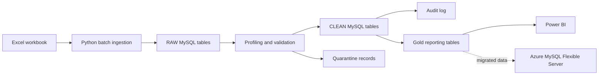
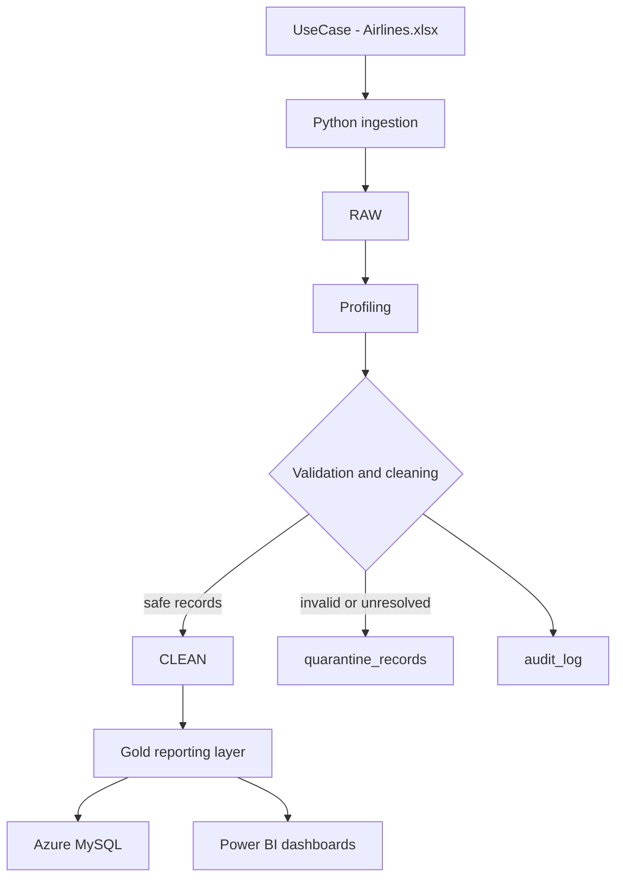

# ASG Airlines Data Engineering

An end-to-end data engineering assessment for turning airline operational data into validated, auditable, PII-aware reporting data for Power BI.

The project was developed locally with Python and MySQL, validated against the assessment edge cases, and deployed to Azure Database for MySQL Flexible Server.

## Business Problem

ASG Airlines receives flight, booking, passenger, and payment data from operational systems. The source workbook contains missing values, malformed identifiers, duplicate and conflicting records, invalid timestamps, formula-based duration values, and payment anomalies.

The pipeline must preserve source data, make corrections explainable, isolate unsafe records, and produce reporting-ready data without fabricating business facts.

## Objectives

- Ingest the source workbook without changing raw values.
- Profile and validate source quality.
- Clean records according to the locked ASG Airlines Edge Case Rulebook.
- Audit automatic corrections and quarantine unresolved records.
- Protect passenger PII before reporting.
- Build a Gold layer for analytics and Power BI.
- Preserve batch traceability, replayability, and idempotent processing.
- Synchronize validated local data incrementally to Azure Database for MySQL.

## Architecture



Logical layers:

| Layer | Purpose | Main tables |
|---|---|---|
| Control | Run and batch metadata | `etl_runs`, `etl_batches` |
| RAW | Immutable source-preserving records | `raw_flights`, `raw_bookings`, `raw_passengers`, `raw_payments` |
| CLEAN | Typed and rule-processed records | `clean_flights`, `clean_bookings`, `clean_passengers`, `clean_payments` |
| Audit/quarantine | Correction history and unresolved records | `audit_log`, `quarantine_records` |
| Reference/configuration | Extendable mappings and settings | Reference tables, currently empty |
| GOLD | Reporting-ready dimensions, facts, and aggregates | Four Gold tables |

## Technology Stack

- Python, Pandas, and OpenPyXL
- MySQL 8.x
- SQLAlchemy and PyMySQL
- Python-dotenv for local configuration
- Pytest dependency for focused testing
- Git and GitHub
- Power BI Project format (`.pbip`), PBIR, and TMDL
- Azure Database for MySQL Flexible Server

## End-to-End Data Flow



## Ingestion

The source workbook is [`data/raw/UseCase - Airlines.xlsx`](data/raw/UseCase%20-%20Airlines.xlsx). `src/ingest.py` reads it with OpenPyXL and writes source values to the four RAW tables in batches of 200 rows.

Each ingestion run records `run_id`, `batch_id`, source file/hash, source Excel row number, ingestion timestamp, record hash, and original row payload. The raw layer is not cleaned or overwritten during ingestion. Reprocessing a successfully ingested file is skipped using its file hash.

## Cleaning and Transformation

`src/cleaning.py` reads RAW data and writes CLEAN data in a transaction according to the locked rulebook. It handles duplicate bookings, conflicting records, timestamps, durations, payment amounts, missing payment IDs, and deterministic quarantine behavior.

Flight duration includes overnight flights: departure and arrival timestamps are normalized, next-day arrivals are respected, and duration is calculated without producing negative values. Duration is retained in the Gold flight dimension.

Multiple payments per booking remain valid and are never deduplicated by `booking_id`. Automatic corrections are recorded in `audit_log`. `src/transformation.py` builds the four Gold tables from CLEAN without modifying RAW or CLEAN.

## Data Quality and Quarantine

Unsafe records are written to `quarantine_records` with entity, source row, run/batch metadata, issue category, reason, severity, and original payload where available.

| Entity and reason | Count |
|---|---:|
| Flight ID collisions | 16 |
| Invalid flight time | 1 |
| Missing airline | 39 |
| Invalid or duplicate passenger ID | 39 |
| Excluded booking records | 12 |

The project does not silently invent airline, airport, payment-method, status, or other reference values. Reference tables exist in the schema but remain empty because the data did not supply trusted mappings.

## PII Protection

Source data contains passport numbers, Aadhaar IDs, email addresses, phone numbers, names, and emergency contacts. These direct identifiers are excluded from Gold reporting tables and Power BI visuals.

Power BI consumes only `booking_payment_summary`, `dim_flights`, `dim_passengers`, and `fact_bookings`. Credentials are supplied through environment variables or secure runtime configuration and are not committed to Git.

Encryption at rest, Azure Key Vault, managed identity, and production RBAC are recommended future controls; they are not claimed as implemented repository features.

## Gold / Reporting Layer

| Gold table | Grain | Source |
|---|---|---|
| `dim_flights` | One row per valid clean flight | `clean_flights` |
| `dim_passengers` | One row per valid clean passenger, without direct PII | `clean_passengers` |
| `booking_payment_summary` | One row per booking with payment aggregates | `clean_bookings` + `clean_payments` |
| `fact_bookings` | One row per clean booking | `clean_bookings` joined to Gold dimensions and payment summary |

```text
fact_bookings
	|
	+-- booking_id  --> booking_payment_summary
	+-- flight_id    --> dim_flights
	+-- passenger_id --> dim_passengers
```

## Key Business KPIs

- Average Flight Duration: **164.42 minutes**
- Route-wise Flight Traffic
- Flight Distribution by Airline
- Total Revenue: **7,982,087.99**
- Total Bookings: **1,000**
- Total Passengers: **1,000**
- Total Flights: **964**
- Average Booking Value: approximately **7,982.09**
- Booking Status distribution
- Payment category distribution

**True operational delay minutes cannot be calculated from the supplied source because scheduled and actual operational timestamps are not available. The source provides departure, arrival, and duration values, so duration-based statistical anomaly analysis is implemented and validated. For 964 validated flights, the average duration is 164.42 minutes, the population standard deviation is approximately 77.33 minutes, the anomaly thresholds are approximately 9.75–319.08 minutes, and 0 duration anomalies were detected (0% anomaly rate).**

## Validation Summary

| Area | Table or metric | Count/value |
|---|---|---:|
| RAW | `raw_flights` / `raw_bookings` | 1,020 / 1,012 |
| RAW | `raw_passengers` / `raw_payments` | 1,039 / 1,000 |
| CLEAN | `clean_flights` / `clean_bookings` | 964 / 1,000 |
| CLEAN | `clean_passengers` / `clean_payments` | 1,000 / 1,000 |
| Governance | `audit_log` / `quarantine_records` | 78 / 107 |
| Control | `etl_runs` / `etl_batches` | 1 / 23 |
| GOLD | `dim_flights` / `dim_passengers` | 964 / 1,000 |
| GOLD | `booking_payment_summary` / `fact_bookings` | 1,000 / 1,000 |
| Payments | zero / single / multiple-payment bookings | 363 / 370 / 267 |
| Payments | rows in multiple-payment groups | 630 |
| Payments | orphan payments | 0 |
| Payments | Gold payment total | 7,982,087.99 |
| Relationships | unmatched booking-to-flight records | 42 |
| Anomalies | duration anomalies / anomaly rate | 0 / 0% |
| Anomalies | average duration / thresholds | 164.42 minutes / approximately 9.75–319.08 minutes |

Gold keys are unique, quarantine traceability passed, payment preservation passed, and Gold processing is idempotent.

## Azure Deployment

| Setting | Value |
|---|---|
| Resource group | `rg-neostats-airlines` |
| MySQL server | `asg-airlines-mysql-2026` |
| Database | `asg_airlines` |
| Region | South India |

Azure Database for MySQL Flexible Server is deployed with the same validated architecture. Core tables and Gold tables were synchronized successfully, and local-versus-Azure row counts reconcile exactly for the synchronized tables. Incremental synchronization uses bounded batches, key-based upserts, deterministic logical keys for governance records, preflight identity/schema checks, and post-sync reconciliation. Normal scheduled runs use `scripts/sync_local_to_azure.py`; `migrate_local_to_azure.py` and `migrate_gold_to_azure.py` remain available for initial provisioning or recovery only. Azure credentials are runtime environment variables only.

## Power BI

The repository contains `powerbi/ASG-Airlines-Dashboard.pbip`, `powerbi/ASG-Airlines-Dashboard.pbix`, PBIR report definitions, and the TMDL semantic model.

The two report pages are:

1. **ASG Airlines | Executive Operations Dashboard**: Total Bookings, Total Passengers, Total Revenue, Total Flights, Average Booking Value, booking and revenue trends, airline distribution, route analysis, booking status, payment category, passenger age groups, and interactive slicers.
2. **ASG Airlines | Flight Operations Analysis**: Average Flight Duration, Total Flights, Validated Flights, Flights by Airline, Average Duration by Airline, Route-wise Flight Traffic, Flight Duration by Airline, Flights by Source, Flights by Destination, operational slicers, and the Duration Anomaly Analysis / Data Quality insight section.

Power BI consumes Gold tables only and does not expose direct passenger PII. Existing measures include `Total Bookings`, `Total Passengers`, `Total Flights`, `Total Revenue`, `Average Booking Value`, and `Revenue per Passenger`. Power BI Desktop refresh remains manual.

## Project Structure

```text
ASG-Airlines-Data-Engineering/
├── .github/
├── README.md
├── .env.example
├── requirements.txt
├── config/
├── data/raw/
├── src/
├── sql/
├── tests/
├── scripts/
│   ├── migrate_local_to_azure.py
│   ├── migrate_gold_to_azure.py
│   ├── sync_local_to_azure.py
│   ├── run_pipeline.py
│   └── generate_powerbi_dashboard.py
├── docs/
├── azure/
└── powerbi/
```

## Validation and Testing

Completed validation includes Python syntax checks, workbook and batch validation, profiling, data-quality checks, RAW/CLEAN reconciliation, payment preservation, quarantine traceability, Gold uniqueness, payment-total reconciliation, idempotency, PBIR JSON/queryState validation, model-reference validation, page bounds, and visual-overlap validation.

## How to Run Locally

```powershell
python -m venv .venv
.venv\Scripts\Activate.ps1
python -m pip install -r requirements.txt
```

Configure `config/.env` outside Git:

```text
DB_HOST=127.0.0.1
DB_PORT=3306
DB_USER=root
DB_PASSWORD=<local-secret>
DB_NAME=asg_airlines
DB_EXTRA_PARAMS=
```

Implemented local commands:

```powershell
.venv\Scripts\python.exe -m src.ingest
.venv\Scripts\python.exe -m src.profiling
.venv\Scripts\python.exe -m src.cleaning
.venv\Scripts\python.exe -m src.validation
.venv\Scripts\python.exe -m src.transformation
.venv\Scripts\python.exe scripts\generate_powerbi_dashboard.py
```

## Automated Pipeline Execution

The local orchestrator runs the existing stages in order: source detection and SHA-256 hashing, ingestion, profiling, cleaning, validation, Gold transformation, Azure core synchronization, and Azure Gold synchronization. It stops on the first failed stage and records the source hash only after the complete selected run succeeds. Existing ingestion hash/idempotency checks remain the source-of-truth safeguards.

Each run writes a timestamped log under `logs/pipeline/`. The last successful source hash is stored in `data/state/last_successful_source.json`; an unchanged source exits successfully without reprocessing. Logs redact configured secret values and never print environment variables.

Run the default local-plus-Azure flow:

```powershell
.venv\Scripts\python.exe scripts\run_pipeline.py
```

Run with an explicit source or skip Azure synchronization:

```powershell
.venv\Scripts\python.exe scripts\run_pipeline.py --file "data/raw/UseCase - Airlines.xlsx"
.venv\Scripts\python.exe scripts\run_pipeline.py --skip-azure
```

Other supported modes:

```powershell
.venv\Scripts\python.exe scripts\run_pipeline.py --dry-run
.venv\Scripts\python.exe scripts\run_pipeline.py --skip-profiling
.venv\Scripts\python.exe scripts\run_pipeline.py --preflight-azure
.venv\Scripts\python.exe scripts\run_pipeline.py --watch
```

`--watch` polls the configured workbook every 30 seconds, ignores Excel lock files, and processes each new source hash once. Stop it with Ctrl+C. The Windows wrapper is `scripts\run_pipeline.ps1`.

Install or remove a per-user Windows Task Scheduler task that runs the orchestrator every 30 minutes:

```powershell
.\scripts\install_pipeline_task.ps1
.\scripts\remove_pipeline_task.ps1
```

Azure synchronization is automatic when the orchestrator runs without `--skip-azure`; it uses `scripts\sync_local_to_azure.py` for bounded, key-based upserts into the Azure database. `--preflight-azure` performs read-only schema and local-row checks before synchronization. The original `migrate_local_to_azure.py` and `migrate_gold_to_azure.py` remain available for initial provisioning/recovery only and are not called by scheduled runs. Power BI Desktop refresh is not automated: after Gold data is loaded, open `powerbi\ASG-Airlines-Dashboard.pbip` and use **Refresh**, then verify the report. No brittle GUI automation or untested REST refresh is used.

The pipeline architecture is:

```text
Source Excel
	|
	v
Pipeline Orchestrator (automatic local command, watch, or Task Scheduler)
	|
	v
RAW -> CLEAN -> Validation / Quarantine -> GOLD
									  |
									  v
							  Azure MySQL (optional automatic migration)
									  |
									  v
						 Power BI Desktop (manual refresh)
```

Implemented automatically: source SHA-256 change detection, ingestion, profiling, cleaning, validation, Gold transformation, Azure core synchronization, Azure Gold synchronization, failure propagation, timestamped logs, successful-source state tracking, incremental/idempotent Azure upserts, local-vs-Azure reconciliation, and Windows Task Scheduler execution every 30 minutes. Manually triggered: Power BI Desktop Refresh. Future production enhancements: managed orchestration, secret vault integration, monitoring/alerting, and a tested supported Power BI service refresh.

Use migration preflight modes before any Azure data copy:

```powershell
.venv\Scripts\python.exe scripts\migrate_local_to_azure.py --preflight-only
.venv\Scripts\python.exe scripts\migrate_gold_to_azure.py --preflight-only
```

## Data Governance & Privacy

RAW preserves source values for traceability. CLEAN and Gold processing records corrections and quarantines unsafe records. Gold tables exclude direct passenger PII, and dashboard visuals do not display passport, Aadhaar, email, phone, or emergency-contact values. Authorized access to sensitive processing layers is required. Production encryption, Key Vault, managed identity, and RBAC remain recommended enhancements.

## Scalability

The current Python/Pandas implementation is appropriate for the assessment dataset and uses batch-aware, storage-separated processing. At production scale, Azure Data Factory can orchestrate ingestion, Azure Data Lake can hold partitioned RAW data, and Databricks/Spark can process larger volumes. Incremental checkpoints, partitioning, monitoring, alerting, CI/CD, and automated Power BI refresh are future enhancements.

## Known Limitations

1. Scheduled-versus-actual timestamps are unavailable, so true delay minutes cannot be calculated.
2. Duration-based anomaly detection is implemented; no duration anomalies were detected in the assessment dataset.
3. Some authoritative airline, airport/IATA, and payment-method mappings were unavailable.
4. `UNKNOWN` and NULL values are retained where safe resolution is not supported.
5. Current Power BI reporting is based on Gold/reporting tables.
6. Local pipeline execution, incremental Azure MySQL synchronization, and Windows scheduling are implemented; ADF/Databricks orchestration is future work.

## Future Enhancements

- Duration anomaly review workflow and operational alerting
- True delay analysis when scheduled/actual timestamps become available
- Azure Data Factory and Data Lake integration
- Databricks/Spark processing for larger data volumes
- Azure Key Vault and managed identity/RBAC
- Automated Power BI refresh
- Monitoring, alerting, CI/CD, and authoritative reference-data onboarding

## Assignment Requirement Mapping

| Requirement | Implementation | Status |
|---|---|---|
| Data ingestion | Batch Excel ingestion into immutable RAW tables | Complete |
| Data quality | Profiling, validation, reconciliation, and issue reports | Complete |
| Cleaning | Rule-driven RAW-to-CLEAN processing | Complete |
| Duplicate handling | Duplicate/conflict analysis and quarantine | Complete |
| Missing values | Safe derivation, imputation, audit, or quarantine | Complete with limitations |
| Schema/value standardization | Typed CLEAN tables and normalized values | Complete |
| PII protection | Direct PII excluded from Gold/Power BI | Complete |
| Aggregation-ready model | Gold dimensions, booking fact, and payment summary | Complete |
| Average Flight Duration | `dim_flights[duration_minutes]` analysis | Complete |
| Route-wise Traffic | Route-level Gold/Power BI analysis | Complete |
| Distribution of Flights by Airline | Flight-level airline analysis | Complete |
| Delays/Anomalies | Duration-based anomaly analysis implemented; true operational delay unavailable from source | Complete with source limitation |
| Power BI dashboard | PBIP/PBIR dashboard with two pages | Complete |
| Interactive slicers | Airline, date, route, and payment-category slicers | Complete |
| KPI cards | Executive and operations KPI cards | Complete |
| Architecture/data flow/data model documentation | Repository README, SQL, and phase reports | Complete |

## Current Project Status

The local pipeline is implemented and validated, including RAW, CLEAN, audit, quarantine, and GOLD layers. Azure MySQL synchronization is implemented and live-tested: incremental Azure core and Gold synchronization passed with local-versus-Azure count reconciliation, and governance synchronization is idempotent through deterministic logical keys/hashes rather than auto-increment surrogate IDs. Windows Task Scheduler automation is installed and tested. The Power BI PBIP/PBIR dashboard is implemented with two pages, interactive slicers, KPI cards, and the final duration-anomaly/data-quality insight section.

Full automated pipeline execution has been successfully tested, and the latest unchanged-source scheduler run correctly skipped reprocessing. The test suite passed with 20 tests. The final reporting layer contains 964 flights and 1,000 passengers, bookings, payment-summary rows, and fact-booking rows. The principal analytical limitation is true operational delay measurement: the source does not provide scheduled-versus-actual timestamps, so the project reports validated flight duration and statistical anomaly context instead of fabricated delay metrics. Power BI Desktop refresh remains manual. The scheduler trigger was tested separately from the successful full pipeline execution; this README does not claim that the specific full seven-stage run was produced by Task Scheduler.

## Submission Deliverables

- Python ingestion, profiling, cleaning, validation, and Gold transformation modules
- MySQL schema scripts for control, RAW, CLEAN, audit, quarantine, reference, and Gold layers
- Validation and transformation reports under `docs/`
- One-off local-to-Azure migration utilities with preflight checks
- Power BI `.pbix` and `.pbip` project files
- PBIR report definition with executive and flight-operations pages
- TMDL semantic model and existing DAX measures
- Final Power BI dashboard screenshot
- This README documenting architecture, implementation, validation, limitations, and future work
